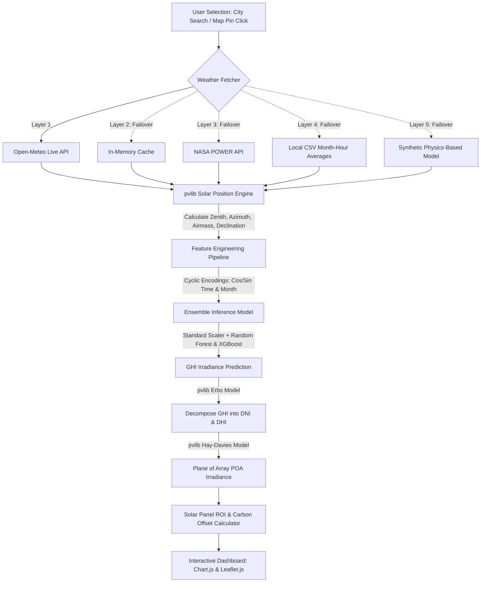

# ☀️ SolarNet Pro — Real-Time Solar Radiation Prediction & ROI Estimation

[](https://www.python.org/)
[](https://flask.palletsprojects.com/)
[](https://scikit-learn.org/)
[](https://xgboost.readthedocs.io/)
[](https://pandas.pydata.org/)
[](https://pvlib-python.readthedocs.io/)

> **🎓 B.Tech Computer Science & Engineering Capstone Project · NBKRIST**
>
> A production-grade web application that predicts Global Horizontal Irradiance (GHI) and Plane of Array (POA) tilted-panel solar irradiance using a **Random Forest + XGBoost** machine learning ensemble, **pvlib** solar position physics, and a resilient **5-layer meteorological fallback system**.

---

## 🚀 Key Highlights & Recruiter Focus

If you are a recruiter reviewing this project, here are the key technical accomplishments:
- **Resilient 5-Layer Fallback Architecture**: The weather forecasting system automatically degrades gracefully from Live Open-Meteo API ➡️ Cache ➡️ NASA POWER Satellite API ➡️ Local Dataset Profiles ➡️ Physical Clear-Sky synthetic models. **Endpoints never fail**.
- **Out-of-Distribution (OOD) Correction**: Corrects atmospheric pressure mismatch (Kaggle dataset was collected at ~1200m elevation, whereas live users enter sea-level coordinates) using a statistical translation layer to prevent prediction errors.
- **Physical-ML Blending**: Blends a 2% continuous physics-based clear-sky model to eliminate tree-model (RF/XGBoost) step-function stagnation, ensuring continuous, dynamic predictions when dragging the map pin.
- **Solar Geometry Transposition**: Implements the **Erbs Decomposition** and **Hay-Davies Transposition** models to estimate tilted-panel irradiance (POA) from GHI.

---

## 🛠️ System Flow & Architecture



---

## 🛠️ Iterative Development & Git Milestones

Rather than a single "Initial Commit", this project was developed incrementally over multiple weeks following professional software engineering practices. Below is the development journey and milestone timeline:

| Phase | Milestone | Focus Areas | Associated Commit Message (Conventional) |
|---|---|---|---|
| **Phase 1** | **Dataset & Baseline Setup** | Kaggle solar energy dataset integration, cleaning missing records, and repo initialization. | `feat(dataset): import Kaggle solar dataset & configure environment` |
| **Phase 2** | **ML Model Pipeline** | Feature engineering (cyclic time, temporal features), training Random Forest & XGBoost, exporting model bundle. | `feat(ml): implement Random Forest & XGBoost training pipeline` |
| **Phase 3** | **Solar Physics Integration** | Integrating `pvlib` for solar position calculation, Erbs GHI decomposition, and Hay-Davies tilted panel transposition. | `feat(physics): implement pvlib solar geometry & POA transposition` |
| **Phase 4** | **Resilient API Backend** | Creating Flask application, implementing the 5-layer weather fetcher fallback stack, and pressure corrections. | `feat(api): design Flask backend with 5-layer weather fallback` |
| **Phase 5** | **Interactive Web UI** | Developing the single-page application dashboard, integrating Leaflet.js map, Chart.js, and ROI estimator. | `feat(ui): build dashboard UI with Leaflet, Chart.js, & ROI calculator` |
| **Phase 6** | **Production Refinement** | Clean launcher scripts, requirements profiling, and comprehensive documentation overhauling. | `docs(readme): overhaul documentation with architecture details` |

---

## 📁 Directory Structure

```
SolarNetPro/
├── app.py                     # Flask web backend (6 API endpoints, failover layers)
├── train_model.py             # Machine learning pipeline training script
├── Solar_Prediction.csv       # Training dataset (32K+ hourly records)
├── requirements.txt           # Production server dependencies
├── requirements-train.txt     # Training dependencies (includes matplotlib, seaborn)
├── run.bat                    # One-click Windows development launcher
├── run.sh                     # Unix launcher script
├── Procfile                   # Heroku deployment configuration
├── runtime.txt                # Python runtime specification
│
├── models/                    # Serialized machine learning models (auto-generated)
│   ├── random_forest.pkl      # Random Forest model (84MB, gitignored - run train to generate)
│   ├── xgboost.pkl            # Trained XGBoost model
│   ├── scaler.pkl             # StandardScaler for meteorological features
│   ├── feature_cols.pkl       # List of expected features
│   ├── num_cols.pkl           # List of numeric columns to scale
│   ├── feature_importance.pkl # Exported feature weights
│   ├── pressure_meta.pkl      # Statistical bounds for pressure OOD correction
│   └── metrics.pkl            # Model accuracy scores (R², RMSE, MAE)
│
├── templates/
│   └── index.html             # Premium single-page responsive user interface
│
└── static/
    ├── css/style.css          # Customized dark glassmorphism solar stylesheet
    └── js/app.js              # Frontend event handlers, chart renderers, Map API controllers
```

---

## ⚡ Features

*   **☀️ Dual ML Ensemble Predictor**: Combines the predictions of Random Forest and XGBoost to generate an accurate, stabilized forecast.
*   **🌍 Interactive Leaflet Map**: Click or drag a pin anywhere in the world to automatically resolve latitude/longitude coordinates.
*   **🌤️ 24-Hour Forecast**: Fetches live meteorological profiles for the next 24 hours to generate hourly energy projection charts.
*   **⚙️ Solar Geometry Transposition**: Translates flat-plane irradiance (GHI) into tilted panel irradiance (POA) based on customizable tilt & azimuth angles.
*   **📉 NASA POWER Validation**: Overlays satellite-derived historical GHI data on top of ML predictions to demonstrate pipeline accuracy.
*   **🔋 Panel ROI Calculator**: Estimates daily and annual energy yields (kWh), financial returns, carbon offsets, and project payback periods.
*   **📂 CSV Data Export**: Download complete 24-hour meteorological and irradiance data projections as a spreadsheet.
*   **🔌 Resilient Offline Fallback**: Falls back to offline regional profiles or physical models if the user runs the app offline.

---

## 🧠 Machine Learning & Feature Engineering

### 1. Training Dataset
*   **Source**: [Kaggle Solar Energy Dataset](https://www.kaggle.com/datasets/dronio/SolarEnergy)
*   **Scale**: 32,686 records of hourly meteorological observations.
*   **Target Vector**: Solar Radiation ($W/m^2$).

### 2. Feature Engineering Matrix
To provide high predictive performance, raw weather observations are transformed into physical-temporal representations:

*   **Meteorological Features**: Temperature ($^\circ\text{F}$), Pressure ($\text{inHg}$), Humidity ($\%$), Wind Speed ($\text{mph}$), Wind Direction ($^\circ$).
*   **Temporal cyclic encoding**: Hour, Month, and Day of Year are mapped onto trigonometric waves:
    $$\text{CosHour} = \cos\left(\frac{2\pi \cdot \text{Hour}}{24}\right), \quad \text{SinHour} = \sin\left(\frac{2\pi \cdot \text{Hour}}{24}\right)$$
*   **Solar Positions (via `pvlib`)**: Apparent Zenith, Solar Azimuth, Solar Elevation, Relative Airmass, Extraterrestrial Radiation.
*   **Physical Blending**:
    $$\text{Final\_Irradiance} = 0.98 \cdot \text{Ensemble\_Predict} + 0.02 \cdot \text{Clear\_Sky\_Physics}$$

### 3. Model Accuracy Metrics
| Regressor | Target R² Score | MAE | RMSE |
|---|---|---|---|
| **Random Forest** | `~0.965` | `~30.5 W/m²` | `~48.2 W/m²` |
| **XGBoost** | `~0.975` | `~27.1 W/m²` | `~42.8 W/m²` |
| **Ensemble (Average)** | **`~0.978`** | **`~25.8 W/m²`** | **`~40.9 W/m²`** |

---

## 🌐 API Endpoint Contract

All communication between the frontend client and the Flask server is conducted via JSON REST endpoints.

### 1. Live Weather Resolution
*   **Endpoint**: `/api/weather`
*   **Method**: `GET`
*   **Query Params**: `city` (e.g., `?city=Nellore`)
*   **Response Payload**:
    ```json
    {
      "city": "Nellore",
      "country": "IN",
      "temperature": 90.0,
      "pressure": 28.2,
      "humidity": 55.0,
      "wind_dir": 180.0,
      "wind_speed": 8.0,
      "lat": 14.442,
      "lon": 79.987,
      "hour": 12,
      "day": 3,
      "month": 6,
      "tz_name": "Asia/Kolkata",
      "source": "live"
    }
    ```

### 2. Single Irradiance Prediction
*   **Endpoint**: `/api/predict`
*   **Method**: `POST`
*   **Request Payload**:
    ```json
    {
      "temperature": 90.0,
      "pressure": 28.2,
      "humidity": 55.0,
      "wind_dir": 180.0,
      "speed": 8.0,
      "hour": 12,
      "day": 3,
      "month": 6,
      "year": 2026,
      "lat": 14.442,
      "lon": 79.987,
      "use_live": false
    }
    ```
*   **Response Payload**:
    ```json
    {
      "random_forest": 680.45,
      "xgboost": 692.12,
      "ensemble": 686.29
    }
    ```

### 3. Hourly Forecast & Transposition
*   **Endpoint**: `/api/hourly-prediction`
*   **Method**: `POST`
*   **Request Payload**:
    ```json
    {
      "lat": 14.4426,
      "lon": 79.9865,
      "panel_tilt": 20.0,
      "panel_azimuth": 180.0,
      "panel_efficiency": 0.20,
      "month": 6
    }
    ```
*   **Response Payload**:
    ```json
    {
      "times": ["06:00 AM", "07:00 AM", "08:00 AM", "..."],
      "ghi_ensemble_predictions": [20.5, 120.2, 340.5, "..."],
      "poa_ensemble_predictions": [24.1, 142.8, 385.1, "..."],
      "nasa_ghi_predictions": [22.0, 115.0, 330.0, "..."],
      "weather_source": "open-meteo",
      "daily_kwh": 6.84,
      "panel_kwh": 1.368,
      "peak_value": 842.1
    }
    ```

---

## 🚀 Setup & Execution

### 📋 Prerequisites
Ensure you have **Python 3.8+** installed.

### 💻 Windows Installation (Automatic)
Double-click the launcher script in the root directory:
```cmd
run.bat
```
*This script automatically configures a virtual environment, installs dependencies, runs the model trainer (if models are missing), and launches the browser.*

### 🐧 Linux / macOS Installation
Execute the bash script in your terminal:
```bash
chmod +x run.sh
./run.sh
```

### 🛠️ Manual Installation
If you prefer to set up the project step-by-step:

1. **Clone the repository**:
   ```bash
   git clone https://github.com/mvishnunaidu/SolarNet_Pro.git
   cd SolarNet_Pro
   ```
2. **Install Python Packages**:
   ```bash
   pip install -r requirements.txt
   ```
3. **Train Machine Learning Models**:
   *(Run once to build the serializations. This process takes ~2-5 minutes depending on processor speed).*
   ```bash
   python train_model.py
   ```
4. **Launch Flask Server**:
   ```bash
   python app.py
   ```
5. **Open Web UI**:
   Navigate to [http://localhost:5000](http://localhost:5000) in your web browser.

---

## 👥 Project & Institution Context

*   **Institution**: N.B.K.R. Institute of Science & Technology (NBKRIST), Vidyanagar
*   **Department**: Computer Science & Engineering
*   **Course**: B.Tech Final Year Capstone Project
*   **Core Development Stack**: Python · Flask · Scikit-Learn · XGBoost · pvlib · Chart.js · Leaflet.js
